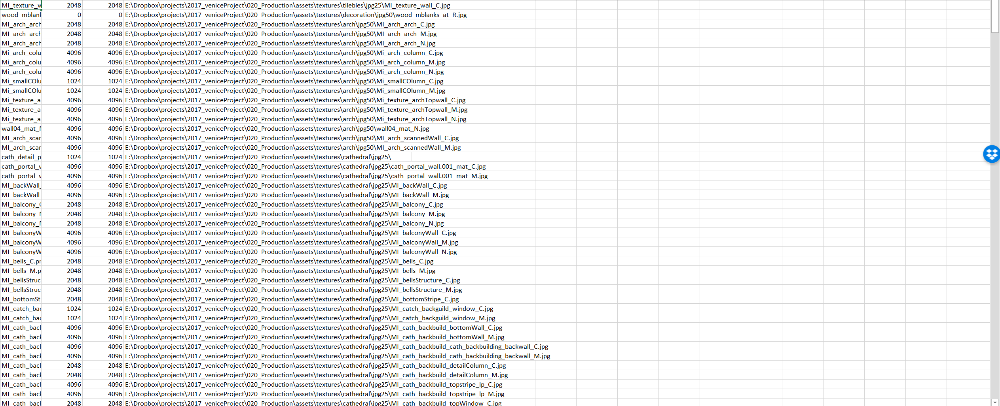

# Texture CSV 

This is a small addon to export all image paths from a blend file into a csv. This paths can be manipulated in a software like Excel and be reimported to change the actual image paths of the blend file. The second functionality is to automatically create a material nodetree for every material in the scene. This is currently destructive and applies to all materials! Why should I need that?!

I was working on a project with over 800 texture files and simply lost the overview. I didn't have the time to spend a lot of energy and time into creating a fancy tool inside of blender itself. Beeing able to export it to excel made it much easier to keep an overview, check for missing textures and change file path.

I wrote this small addon especially fot the purpose of one single project. I wanted to be abble to quickly change texture resolutions and texture files. It was never designed to be really flexible. Nevertheless, I decided to publish it here as it really saved my life.

# UI
The UI is fairly simple. 
- Export Path: defines the folder the csv will be saved to and loaded from. Currently the csv name is set to blend file name + materialcsv. 
- Change All Image Extensions: Operator to change all image extensions (e.g. form jpg to png)
- Append To CSV: Doesn't overwrite the csv but appends the image paths at the bottom
- Import CSV: Imports the csv and replaces all image paths for the images found in the csv

#Example: 
The goal for this scene was to create an environment where you could place the camera basically everywhere and the scene would still work. This means a lot of huge textures. Loading all textures for rendering took about half an hour!!!! I don't need the full resolution for all textures at all time. And for preview I wanted to easily scale textures down. Using the jpg with a resolution of 25% reduced the loading of the textures from half an hour to about 1 minute. Which really saved my life when iterating and doing lighting. 

